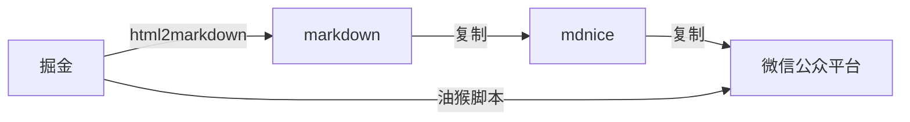

# 油猴文章拷贝助手

## 为什么要写这个脚本

### 流程

### 使用脚本流程

### HTML 转 markdown

https://www.bejson.com/convert/html2markdown/

https://devtool.tech/html-md

https://github.com/mixmark-io/turndown

## 使用

- 第一步： [安装 chrome 油猴扩展](https://chrome.pictureknow.com/extension?id=4d999497b75d4eb6acf4d0db3053f1af)
- 第二步： [安装文章拷贝助手](https://greasyfork.org/zh-CN/scripts/439663-copy-helper)

## 实现代码

大部分代码来自 [markdown-nice](https://github.com/mdnice/markdown-nice)

## TODO

兼容更多平台

- [ ] 简书

- [ ] 思否

- [ ] CSDN
